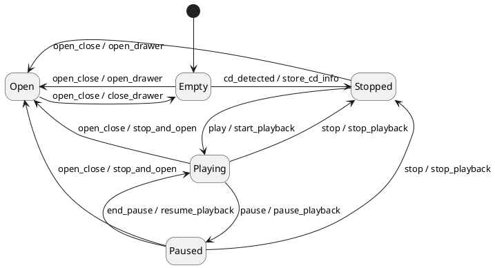

# Реализация обобщенного конечного автомата
```simplesm.h``` - шаблонные классы конечного автомата и состояния

# пример использования


```example.cpp``` Использование показано на примере управления виртуальным cd проигрывателем (по мотивам fsm из boost)

Граф состояний проигрывателя



```c++
void test()
{
  Player player;
  // Начало работы конечного автомата, вход в начальное состояние Empty
  player.Start();

  player.HandleMessage(open_close{}); player.pstate();  // Открываем проигрыватель
  player.HandleMessage(open_close()); player.pstate();  // Загружаем cd, закрываем
  player.HandleMessage(cd_detected("louie, louie"));  // Определение альбома
  player.HandleMessage(play());  /// начало проигрывания

  // Проигрывание
  // События для вложенного, нереализованного КА
  player.HandleMessage(NextSong());player.pstate();  //2nd song active
  player.HandleMessage(NextSong());player.pstate();  //3rd song active
  player.HandleMessage(PreviousSong());player.pstate();  //2nd song active

  player.HandleMessage(pause()); player.pstate();  // Пауза

  player.HandleMessage(end_pause());  player.pstate();  // Конец паузы, продолжение проигрывания
  player.HandleMessage(pause()); player.pstate();  // Снова пауза
  player.HandleMessage(stop());  player.pstate();  // Стоп
  // event leading to the same state
  player.HandleMessage(stop());  player.pstate();  // Снова стоп
}
```